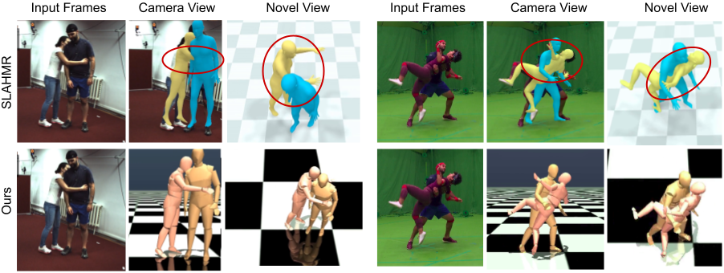

#  MultiPhys: Physics-aware 3D Motion 
Code repository for the paper:
**MultiPhys: Multi-Person Physics-aware 3D Motion Estimation**

[Nicolas Ugrinovic](http://www.iri.upc.edu/people/nugrinovic), 
[Boxiao Pan](https://cs.stanford.edu/~bxpan/), 
[Georgios Pavlakos](https://geopavlakos.github.io/), 
[Despoina Paschalidou](https://paschalidoud.github.io/), 
[Bokui Shen](https://cs.stanford.edu/people/bshen88/), 
[Jordi Sanchez-Riera](https://www.iri.upc.edu/staff/jsanchez), 
[Francesc Moreno-Noguer](http://www.iri.upc.edu/people/fmoreno/), 
[Leonidas Guibas](https://geometry.stanford.edu/member/guibas/), 


[](https://arxiv.org/pdf/2404.11987.pdf)  [](http://www.iri.upc.edu/people/nugrinovic/multiphys/)     




[//]: # (## Code comming soon...)

## News
[2024/06] Demo code release!
## Installation
This code was tested on Ubuntu 20.04 LTS and requires a CUDA-capable GPU.

1. First you need to clone the repository:
    ```
    git clone https://github.com/nicolasugrinovic/multiphys.git
    cd multiphys
    ```

 
2. Setup the conda environment, run the following command:

    ```bash
    bash install_conda.sh
    ```
   
    <details>
        <summary>We also include the following steps for trouble-shooting.</summary>
   EITHER:
   
   * Manually install the env and dependencies
       ```bash
          conda create -n multiphys python=3.9 -y
          conda activate multiphys
          # install pytorch using pip, update with appropriate cuda drivers if necessary
          pip install torch==1.13.0 torchvision==0.14.0 --index-url https://download.pytorch.org/whl/cu117
          # uncomment if pip installation isn't working
          # conda install pytorch=1.13.0 torchvision=0.14.0 pytorch-cuda=11.7 -c pytorch -c nvidia -y
          # install remaining requirements
          pip install -r requirements.txt
       ```
   OR:
   * Create environment
       We use PyTorch 1.13.0 with CUDA 11.7. Use `env_build.yaml` to speed up installation using already-solved dependencies, though it might not be compatible with your CUDA driver.
       ```
       conda env create -f env_build.yml
       conda activate multiphys
       ```
  </details>

3. Download and setup mujoco: [Mujoco](https://mujoco.org/)
    ```bash
    wget https://github.com/deepmind/mujoco/releases/download/2.1.0/mujoco210-linux-x86_64.tar.gz
    tar -xzf mujoco210-linux-x86_64.tar.gz
    mkdir ~/.mujoco
    mv mujoco210 ~/.mujoco/
    export LD_LIBRARY_PATH=$LD_LIBRARY_PATH:~/.mujoco/mujoco210/bin
    ```
    If you have any problems with this, please follow the instructions in the [EmbodiedPose repo](https://github.com/zhengyiluo/EmbodiedPose?tab=readme-ov-file#dependencies) regarding MuJoCo.
    

4. Download the data for the demo, this includes the used models:

    ```bash
    bash fetch_demo_data.sh
    ```

    <details>
      <summary>Trouble-shooting</summary>

   * Download SMPL paramters from [SMPL](https://smpl.is.tue.mpg.de/). Put them in the `data/smpl` folder, unzip them into `data/smpl` folder. 
   Please download the v1.1.0 version, which contains the neutral humanoid. 
   * Download vPoser paramters from [SMPL-X](https://smpl-x.is.tue.mpg.de/). Put them in the `data/vposer` folder, unzip them into `data/vposer` folder.
  </details>

5. (optional) Our code uses EGL to render MuJoCo simulation results in a headless fashion, so you need to have EGL installed. 
You MAY need to run the following or similar commands, depending on your system:
    ```bash
   sudo apt-get install libglfw3-dev libgles2-mesa-dev
    ```


## Generating physically corrected motion.
The data used here, including SLAHMR estimates should have 
been donwloaded and placed to the correct folders by using the `fetch_demo_data.sh` script. 

 Run the demo script. You can use the following command:

   EITHER, to generate several sequences:
   ```bash
   bash run_demo.sh
   ```
   OR, to generate one sequence:
   ```bash
   export LD_LIBRARY_PATH=$LD_LIBRARY_PATH:/usr/lib/nvidia:/home/nugrinovic/.mujoco/mujoco210/bin;
   export MUJOCO_GL='egl';
   # generate sequence
   # expi sequences
   python run.py --cfg tcn_voxel_4_5_chi3d_multi_hum --data sample_data/expi/expi_acro1_p1_phalpBox_all_slaInit_slaCam.pkl --data_name expi --name slahmr_override_loop2 --loops_uhc 2 --filter acro1_around-the-back1_cam20
   ```
 <details>
   <summary>Trouble-shooting</summary>

   * If you have any issues when running mujoco_py for the first time while compiling, take a look 
   at this github issue: [mujoco_py issue](https://github.com/openai/mujoco-py/issues/773#issuecomment-1639684035)
</details>


This will generate a video with each sample that appear in the paper and in the paper's video. Resuls are 
saved in the `results/scene+/tcn_voxel_4_5_chi3d_multi_hum/results` folder. For each dataset this will
generate a folder with the results, following the structure:

```bash
<dataset-name>
├── slahmr_override_loop2
    ├── <subject-name>
        ├── <action-name>
           ├── <date>
              ├── 1_results_w_2d_p1.mp4
              ├── ...
```

## TODO List

- [x] Demo/inference code
- [ ] Data pre-processing code
- [ ] Evaluation

## Acknowledgements

Parts of the code are taken or adapted from the following amazing repos:

- [EmbodiedPose](https://github.com/zhengyiluo/EmbodiedPose) 
- [SLAHMR](https://github.com/vye16/slahmr)
- [HuMoR](https://github.com/davrempe/humor)
- [Pose-GPT (naverlabs)](https://github.com/naver/PoseGPT)


## Citing

If you find this code useful for your research, please consider citing the following paper:


```bibtex
@inproceedings{ugrinovic2024multiphys,
                author={Ugrinovic, Nicolas and Pan, Boxiao and Pavlakos, Georgios and Paschalidou, Despoina and Shen, Bokui and Sanchez-Riera, Jordi and Moreno-Noguer, Francesc and Guibas, Leonidas},
                title={MultiPhys: Multi-Person Physics-aware 3D Motion Estimation},
                booktitle={Conference on Computer Vision and Pattern Recognition (CVPR)},
                year={2024}
}
```